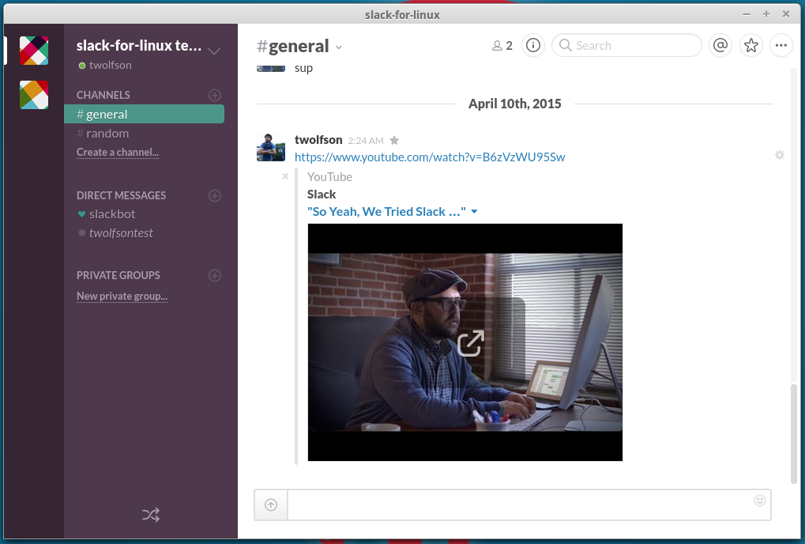

slack-for-linux [](https://travis-ci.org/slack-for-linux/slack-for-linux)
=============

Slack client for Linux. Uses [nw.js][].

**Features:**

- Tray icon with notifications
- Multi-team support
- Watch videos in application



[nw.js]: https://github.com/nwjs/nw.js

Installing
==========

1) [Install Node.js](http://nodejs.org/download/). If Node.js is already installed, please continue.

2) Install `slack-for-linux` via `npm`

```bash
npm install slack-for-linux -g
```

3) Run `slack-for-linux`

If you have setup correctly, the above command will install the package
somewhere in your path.

Then you can run your client from your terminal of choice.

```bash
slack-for-linux
```

Running and Developing
======================

#### Clone the repo

```bash
git clone git@github.com:slack-for-linux/slack-for-linux.git && cd slack-for-linux
```

#### Install dependencies

```bash
npm install
```

#### Run it

```bash
npm start
```

Issues
======
[JBKahn](https://github.com/JBKahn) Pointed out that libudev.so differs on different
machines. If you run into

```
./resources/node-webkit/Linux64/nw: error while loading shared libraries: libudev.so.0: cannot open shared object file: No such file or directory
```

Give [Issue #1](https://github.com/slack-for-linux/slack-for-linux/issues/1) a look.

Contributing
============
Interested in contributing? Great, we are always looking for more great people.

Get started by finding an issue with the "help wanted" label and submitting a pull request.

https://github.com/slack-for-linux/slack-for-linux/issues?q=label%3A%22help+wanted%22

License
=======
`slack-for-linux` is licensed under the [MIT license][].

Upon installation, we may copy `libffmpegsumo.so` from `/opt/google/chrome` (from [ffmpeg][]) into our repository. We are required to mention that this file is licensed under the [GPL license][ffmpeg-license].

[MIT License]: LICENSE
[ffmpeg]: http://ffmpeg.org/
[ffmpeg-license]: docs/ffmpeg-license.txt

------------

[](https://github.com/igrigorik/ga-beacon)
